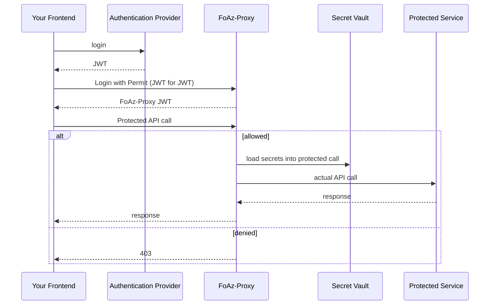

# FoAz


_Frontend-Only-Authorization (a web standard)_

## What is Frontend-Only-Authorization ?

Frontend-only-Authorization (FoAz) is a web standard allowing frontend applications to enforce protected access to APIs without requiring a dedicated backend.
FoAz allows frontend developers to securely use sensitive resources directly from the frontend, while gating for permissions and without exposing any secrets or sensitive data.

## Isn't Frontend Authorization an Oxymoron ?

It sure sounds like it, but no - it works, it's easy, and it's super safe.
The "trick" is that it's frontend-only in the same sense that Serverless has no servers.
There is a backend component which actually enforces the access, you just don't have to build it - FoAz is a generic backend component leveraging policy as code together with a reverse-proxy, and secrets management services to produce a one size fits all backend authorization.

- ### Access 3rd Party Services

  ```mermaid
  flowchart LR
      Frontend --protected API call--> FoAz-proxy
      FoAz-proxy--"permission enforcement + inject secrets"--> p["Protected Service (e.g. AWS S3)"]
      p --response-->FoAz-proxy
      FoAz-proxy --response-->Frontend
  ```

Web applications frequently rely on the integration of external services to realize their functional capabilities. This might entail the utilization of services like Vonage or Twilio for the dissemination of SMS invitations, Stripe for user billing processes, AWS S3 for the retrieval of user profiles, or Mailchimp for the communication of user activities. Each of these operations necessitates the use of a confidential API token or secret, in conjunction with the application developer's account, often incurring a financial cost.

In the absence of Frontend-only Authorization (FoAz), a developer is compelled to deploy a backend service to process frontend requests. This service must verify the session identity, authenticate permissions, and trigger the external API using the associated secret. Contrastingly, FoAz allows developers to directly call the external service from the frontend interface. The FoAz system, undertakes the responsibility of verifying the user's identity, authenticating permissions, and supplying the requisite secrets, thereby streamlining the process for developers.

- ### Adding Authorization on top of Your API

  ```mermaid
  flowchart LR
      Frontend --protected API call--> FoAz-proxy
      FoAz-proxy --"permission enforcement"--> p["Your app [secret route]"]
      p --response-->FoAz-proxy
      FoAz-proxy --response-->Frontend
  ```

  Be it legacy code, new code, or an app still being developed, your homebrew authorization probably doesn't meet the standard you need from it.
  While we'd always encourage you to deploy full fledged backend authorization as part of your backend to make your application's authorization truly future-proof, we understand the importance of RND velocity.

  FoAz can be used to wrap and protect your API, adding more complex policies (e.g. RBAC, ABAC, ReBAC) and access-control interfaces (e.g. audit-logs, user-management), without having to change a single line of backend code.

  :::info
  To use this securely you still need to add a secret between the FoAz-Proxy and your API,
  but this can even be just a separate route (e.g. `your-api.com/secret-guid/resource`), or gated by a API-gateway or reverse-proxy.
  :::

## How does FoAz Work?

### Communication Sequence Diagram



## Dive deeper - RFC and Working Group

With the ambition of turning FoAZ into a wide spread internet standard part of the efforts here include technical implementation details ([RFC](/standard/RFC.mdx)), security guidelines, and working group contribution guidelines.
